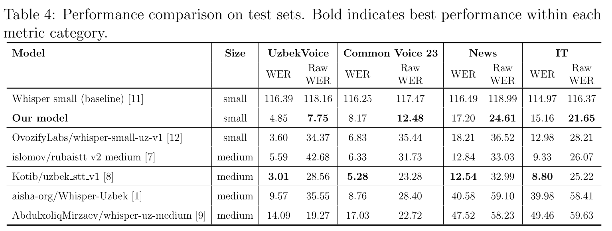
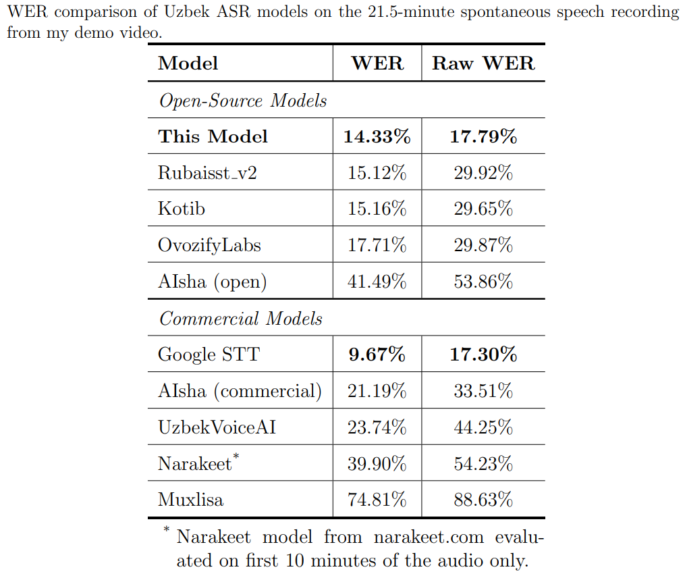
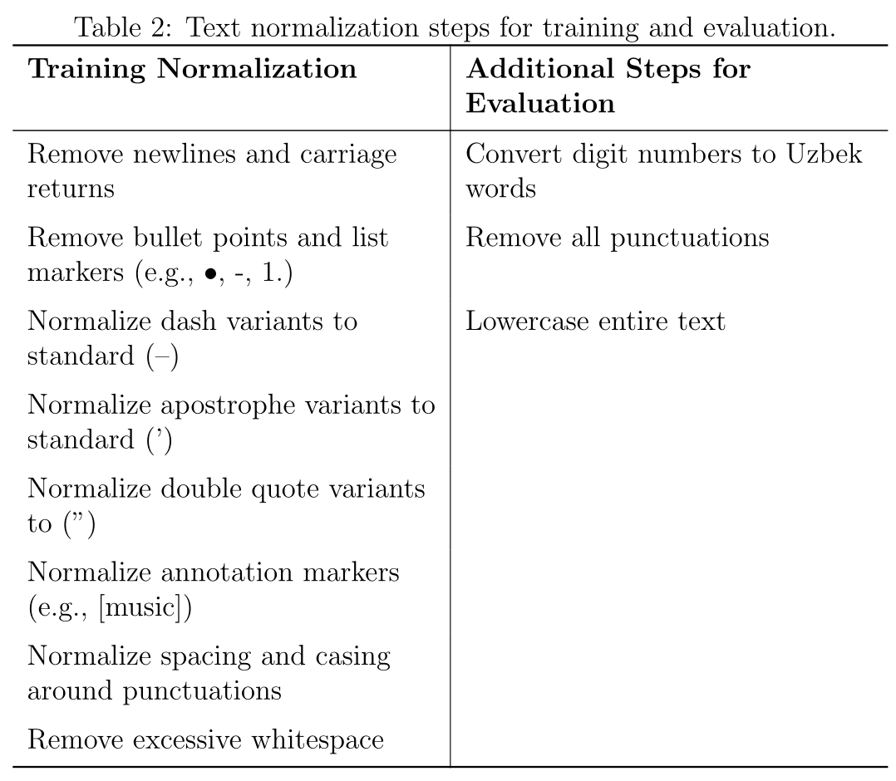

# Fine-Tuning Uzbek Speech-to-Text with Whisper

This repository contains the code and experimental pipeline for fine-tuning a multilingual Automatic Speech
Recognition (ASR) model for the Uzbek language using **OpenAI Whisper-small**.

## Overview

This project fine-tunes Whisper-small on carefully filtered Uzbek speech data while preserving natural formatting, such
as punctuation, casing, and proper number formats. As around 70% of read speech data is not validated, we used Google
Speech-To-Text (STT)
and Gemini 2.5 Pro were used to filter the audio samples that aligned with the reference transcriptions, prioritizing
quality over quantity.

**The resulting model achieves:**

- **4.85 – 8.17% WER** on read speech
- **15.16 – 17.20% WER** on conversational speech
- **Raw WER is only 3 – 7.5 percentage points** higher than standard WER when punctuation, casing, and numbers are
  preserved

**Dataset Used:**

- UzbekVoice: 206.5 hours (crowdsourced read speech)
- Common Voice 23: 9.6 hours (crowdsourced read speech)
- FeruzaSpeech: 4.6 hours (single-speaker read speech)
- News: 107.3 hours (conversational speech from news/podcasts)
- IT: 7 hours (domain-specific conversational speech)

Total training data: 335 hours (without augmentation)

**Comparison:**

- Open-Source models comparison on my test set

  

- 21.5 minutes of my personal [demo video](https://youtu.be/RS_Bh540Hhs)

  

## Important Note

⚠️ **This model is not publicly released** due to terms of service concerns: using Google's Gemini 2.5 Pro and
Speech-to-Text outputs to train a competing ASR model
violates [Section 16(a) of Google Cloud's Service Specific Terms](https://cloud.google.com/terms/service-terms), which
prohibits using AI/ML service outputs to develop similar or competing products. We directly used these services to
filter out the audio-transcription aligned data. Also, the publicly available conversational datasets we used were
transcribed by Gemini 2.5 Pro. Both are violating the terms.

## Methodology

**Text Normalization:**
Training preserves punctuation, casing, and numeric formats to enable naturally formatted transcriptions.

  

As FeruzaSpeech originally read from Cyrillic script and the Latin script was poorly transliterated by online tool, we
developed a custom Cyrillic-to-Latin transliteration system based on the 18 orthographic differences documented
by [Davidov](https://doi.org/10.5281/zenodo.5584563). Our implementation addresses 16 key distinctions between the two
scripts to ensure accurate transliteration.

**Audio Preprocessing:**

- Resample to 16 kHz
- Convert to mono channel
- High-pass filtering (80 Hz cutoff)
- Silence removal (1.3s threshold)
- RMS normalization (-23 dB)

**Training Strategy:**

- Stage 1 - foundation training on filtered dataset:
    * used only aligned audio transcription for read speech,
    * allowed more room for less aligned audio transcription for conversational speech data
    * without augmentation
    * Total training time: 5 hours with 5 epochs, lr=1e-5

- Stage 2 - refinement with stricter filtering and augmentation:
    * used only aligned audio transcription for read speech,
    * only used conversational audio samples with closely aligned audio transcriptions
    * with some combination of time stretching, pitch shifting, noise injection, time masking, and augmentation
      techniques
    * Total training time: 2.25 hours with 3 epochs, lr=5e-6

## Limitations

- Limited coverage of specialized domains (medical, legal, technical)
- Possible dialect bias depending on dataset distribution
- Reproducible training requires high-end GPU hardware (NVIDIA RTX A6000)
- Conversational transcripts partly generated with commercial AI services, preventing public model release due to
  licensing concerns

## Future Work

There is currently no fully open Uzbek conversational speech dataset created without reliance on commercial AI
transcription.

Future directions:

- Community-driven conversational speech transcription
- Expansion of literary and domain-specific vocabulary
- Improved handling of code-switching and rare words

The long-term goal is to build the **first legally compliant open high-quality Uzbek STT model and conversational ASR
dataset**.

## Acknowledgments

This work was supported by GPU infrastructure provided by the University of Passau and by contributors to publicly
available Uzbek speech datasets.

## Full Report

For complete methodology, experiments, and analysis, see the project
report: [Fine-Tuning Uzbek Speech-to-Text Model](Report.pdf)

